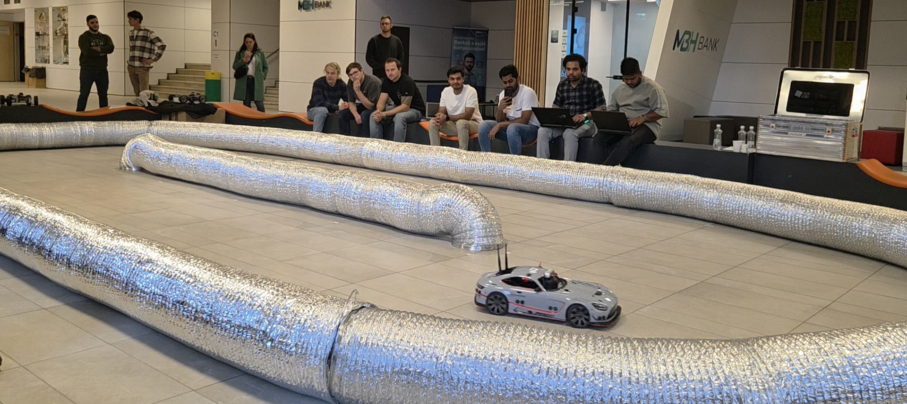
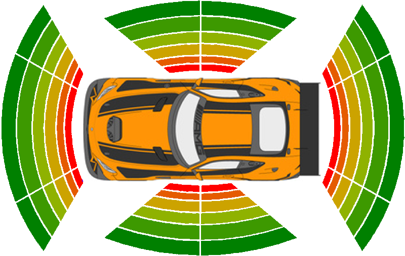
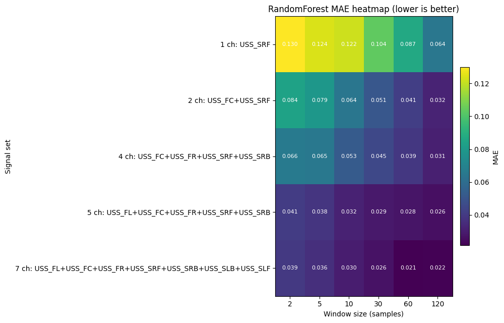
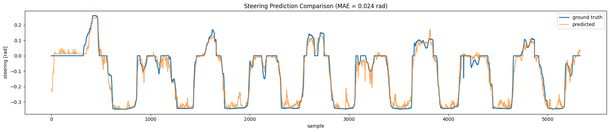

Here is a shorter version:
# MXcarkit Ultrasonic Wall-Following

This project originated from a workshop at **Széchenyi István University** (Győr), led by **Ernő Horváth** and **Rudolf Krecht**. The workshop focused on following an **F1tenth-style racetrack** using robots equipped with **LiDAR** and **stereo cameras**, along with a working LiDAR-based wall-following controller.

Related projects from the university can be found here:
[https://robotverseny.github.io/](https://robotverseny.github.io/)

## Idea

While the provided solution uses **LiDAR**, this repository explores solving the same problem using the **MXcarkit** and its **ultrasonic sensor setup** instead.

## MXcarkit Sensor Setup

The MXcarkit is equipped with **10 ultrasonic sensors** arranged around the vehicle to provide a near-field surround view.
These distance readings are used as input to a model that **predicts the steering angle** needed to follow the track.

## Model: Random Forest on Ultrasonic Sequences

We use a **Random Forest** to predict the steering angle from the ultrasonic measurements. This model is well suited because the sensor data is **noisy** and has **low spatial resolution**, and tree ensembles handle this variability robustly.

Since a single ultrasonic snapshot does not indicate whether the vehicle is in a **straight** or a **curve**, we provide the model with a **sequence of measurements** over time. This gives the model context about the driving situation.

We performed a grid search varying **which ultrasonic sensors are used** and **how long the sequence window is**.

**Result:**

* Using **more ultrasonic sensors** leads to more stable and accurate steering predictions.
* **Longer sequence windows** further improve performance, because they allow the model to recognize track segments (straight vs. curve) rather than reacting only to instantaneous distances.

Here is the revised *Model Evaluation* chapter, now using your **real** hardware specs:

---

## Model Evaluation

In the final step, we aimed to balance **accuracy** and **real-time inference speed**, since the controller must run continuously on the vehicle.

The model was evaluated on a standard Google Colab runtime with:

* Intel(R) Xeon(R) @ 2.20 GHz with ~13 GB RAM

On this setup, the Random Forest runs at approximately:

* **~70 Hz inference rate**
* **Mean Absolute Error (MAE): ~0.024 rad**

This is fast enough to control the MXcarkit in real time while keeping the steering response smooth and stable.

Because the model is trained using **behavioral cloning**, we can directly compare the predicted steering to the **human steering commands** recorded during data collection. The overlay shows that the learned controller closely matches the manual driving behavior, capturing both straights and curves reliably.

